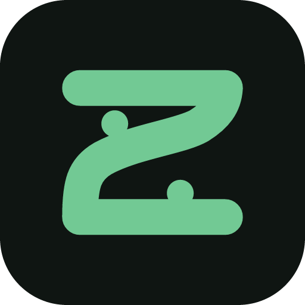

<div align="center">
  
  <h1>ZeppBridge</h1>
  <p><strong>把你的 Zepp 数据，完整交还给你。</strong></p>
  <p>在自己的 Windows / macOS 电脑上查看、备份、导出 Amazfit 手表的健康记录。</p>

  [](https://github.com/lingcang728/ZeppBridge/actions/workflows/ci.yml)
  [](LICENSE)
  [](#下载与安装)
  [](#下载与安装)
  [](https://github.com/lingcang728/ZeppBridge/releases)
</div>

> [!IMPORTANT]
> ZeppBridge 是独立的非官方开源项目，与 Zepp Health、Huami、Amazfit 无隶属或背书关系。只用于你本人有权访问的账号和数据。

## Zepp App 里不是已经有这些数据了吗？

有，但只在手机上，只能按官方给的方式看，而且它是**别人服务器上的一份**。ZeppBridge 解决的是这几件事：

- **在电脑的大屏幕上看。** 心率、睡眠、跑步、恢复、压力、血氧的长期趋势，7 天 / 1 个月 / 6 个月随便切。
- **你手上有一份完整副本。** 所有记录都存进你电脑里的一个文件。断网也能看，换手机、注销账号、App 改版都不影响。
- **想导出就能导出。** JSON、CSV、GPX 三种格式，随便丢进 Excel、Strava 或你自己的脚本。
- **想让 AI 分析，一键就走。** 挑好时间范围和数据类型，自动打包成 AI 读得懂的格式并去掉敏感信息，复制粘贴给 ChatGPT、DeepSeek、豆包都行。

还有一件事值得单独说：**它不会替你把数据补漂亮。**

你那天没戴表，图上就是断的；某项指标手表没测，界面上写「未提供」，不会填成 0；没有 GPS 轨迹就不画地图。健康数据上，一条编出来的漂亮曲线比一个诚实的缺口更糟。

## 支持哪些设备

**只要你的设备能同步到 Zepp App，就能试。** ZeppBridge 读的是你账号在云端的数据，不直接连手表，所以不挑具体型号。

内置的设备库认识 52 款 Amazfit 产品，覆盖 **GTR、GTS、T-Rex、Balance、Active、Bip、Cheetah、Falcon、Helio、Band** 等系列（含手表、臂带、手环、戒指）。认出来的会显示正确的型号和产品图；认不出的照样同步数据，只是显示成通用名字。

具体能拿到哪些指标，取决于你的手表测不测。装好连上后，设置页的「你的设备能提供什么」会按你自己的账号逐条列出来。

## 下载与安装

到 [Releases](https://github.com/lingcang728/ZeppBridge/releases) 页面下载最新版。

**Windows**

1. 下载 `ZeppBridge_<版本>_x64-setup.exe`（或 `.msi`），双击安装。
2. 安装包还没买代码签名证书，Windows 可能弹「未知发布者」，点「更多信息」→「仍要运行」。
3. 以后直接覆盖安装升级，数据不会丢。

**macOS（Apple Silicon）**

1. 下载 `ZeppBridge_<版本>_aarch64.dmg`，打开后把 `ZeppBridge.app` 拖进「应用程序」。
2. 应用是 ad-hoc 签名，没有 Apple 开发者证书也没公证，首次打开会说「无法验证开发者」。**右键点应用 → 打开 → 再点「打开」**即可。
3. macOS 版由 CI 保证能编译、能通过测试，也有贡献者在 Apple Silicon 上实际跑过；但项目维护者本人没有 Mac，没法独立复核同步和钥匙串行为。介意的话建议先在 Windows 上用。

**暂不支持**：Intel Mac、Linux、手机。

**当前是 0.x 版本**，功能在动，界面也会变。数据存在本机、不会上传，但请不要把它当成唯一的备份。

## 第一次连接

1. 打开 ZeppBridge，点左边的「设置」。
2. 点「连接」，会弹出 **Zepp 官方登录页**，用你平时的账号密码登录。
3. 显示「已连接」后窗口自动关闭，应用会自己同步一次。等 40 秒左右，概览页就有内容了。

国内账号、国际账号都可以，登录后应用会自己认出你属于哪个区域的服务器。

第一次只拉最近 30 天。想把过去一年都拉下来，到设置的「导出与补拉偏好」里把天数调大再补拉一次——它会先告诉你大概占多少磁盘。

登录卡住了？看[连接指南](docs/guides/connection.md)，里面有排错步骤和两种备用连接方式。

## 装好之后能做什么

**看趋势**

| 页面 | 能看到什么 |
| --- | --- |
| **概览** | 24 小时心率曲线、今日步数、昨晚睡眠结构、静息心率，以及身体状态和训练状态两个入口 |
| **身体状态** | 恢复程度、压力、血氧、心率变异性、呼吸率、静息心率的长期走势 |
| **训练状态** | 最大摄氧量、训练负荷、乳酸阈值、PAI，以及最近训练量是偏多还是偏少 |
| **最近记录** | 每一次睡眠和每一次运动，点进去看详情 |
| **运动详情** | 距离、配速、心率、每公里分段、GPS 轨迹；跑步还有功率和跑姿 |

**交给 AI**

内置几套提示词模板（表现总结、训练洞察、恢复评估、睡眠分析等）。选好模板和时间范围，点「发送到 AI」，应用会打包好数据、抹掉设备编号和精确位置、复制到剪贴板，并打开你选的 AI 网站。粘贴就能开始问。

数据包超过 2 MB 时会自动存成桌面上的一个文件，拖进对话框即可。

**导出文件**

- **JSON** — 完整结构化数据，适合喂给程序或 AI
- **CSV** — 表格汇总，直接用 Excel 打开
- **GPX** — 标准轨迹格式，可以导入 Strava、佳明等平台

**放着不管**

关掉窗口后应用留在托盘里继续自动同步。不想让它跑，右键托盘图标退出即可。

## 常见问题

**需要一直开着电脑吗？**
不需要。ZeppBridge 每次启动会补上你不在的这段时间。

**关掉手机上的 Zepp App，还能同步吗？**
不能。数据链路是：手表 → 手机 Zepp App → Zepp 云 → ZeppBridge。手表得先通过手机把数据传上云，ZeppBridge 才拉得到。所以手机 App 还是要偶尔打开。

**会不会因此被封号？**
ZeppBridge 用你自己的登录凭据，**只发读取请求**——整个项目里没有任何一处会修改云端数据（可以自己搜，连一个写请求都没有）。行为上和官方 App 打开看数据是一样的。但这毕竟是非官方用法，我们没法替 Zepp 做任何保证。

**同步完发现某项没数据？**
先确认那段时间手表真的测了。有些指标（比如乳酸阈值、最大摄氧量）只在特定运动后才更新，一年也就几次。设置页的「你的设备能提供什么」会告诉你每一项的实际情况——**注意「暂未获取到」不等于「你的手表不支持」**，Zepp 的接口对没有的数据也是返回空，分不出是没测还是不支持。

**我的数据存在哪？**
- **Windows**：安装目录旁边的 `data` 文件夹（不是 `%APPDATA%`）。设置页的「高级与维护」里有「打开数据文件夹」按钮。
- **macOS**：`~/Library/Application Support/com.zeppbridge.ZeppBridge/data`

**卸载后数据还在吗？**
在。卸载不会删 `data` 文件夹，想彻底清理需要手动删除。

**有多块手表会不会混在一起？**
不会。每条记录都记着来自哪台设备，界面上分开显示。

**数据会传到你们的服务器吗？**
没有「我们的服务器」。ZeppBridge 只和 Zepp 官方服务器通信，也没有任何使用统计或崩溃上报。

## 隐私

- **登录凭据**存在系统的凭据管理器里（Windows Credential Manager / macOS 钥匙串），不是明文文件。
- **健康数据**是你电脑上一个未加密的数据库文件。和别人共用电脑的话，请用各自独立的系统账户。
- **交给 AI 时会先脱敏**：自动抹掉设备编号、MAC 地址、精确 GPS 等信息，并在文件里列出抹掉了什么。精确轨迹要你主动勾选才会带上。
- **地图只在本地画**，不会向任何第三方地图服务发请求。
- 同步时要连 Zepp 的服务器，所以这不是一个纯离线软件。

详见[安全与隐私](docs/reference/security-and-privacy.md)。发现安全问题请走 GitHub 私密漏洞报告，不要开公开 issue。

## 给开发者

Tauri 2 + Vue 3 + Rust，本地 SQLite 存储，另有一个只绑 `127.0.0.1` 的只读 REST 接口供本机脚本取标准化的运动序列。

```bash
npm ci
npm run tauri dev
```

- [开发文档](docs/development/development.md) — 构建门禁、command 契约、本机 REST API、验收顺序
- [架构摘要](docs/reference/architecture.md) — 产品边界、Zepp 接口映射、已验证与未验证清单
- [UI 约束](docs/development/ui-guidelines.md) — 设计 token、页面结构、组件清单

欢迎 issue 和 PR。改动前请先读架构摘要里的「未验证清单」——这个项目对「什么算已经确认的事实」有明确标准。

## 致谢

Zepp 的接口没有公开文档，一个数据流是否存在，只能靠已经把它跑通的人写下来。接口映射参考了这几个开源项目：

- [m4ary/zepp-health-cli](https://github.com/m4ary/zepp-health-cli) — 事件接口的划分与字段取值
- [Thejuampi/icu](https://github.com/Thejuampi/icu) — 独立复现同一组接口，可作交叉验证
- [H3llK33p3r/zepp-fit-extractor](https://github.com/H3llK33p3r/zepp-fit-extractor)（Apache-2.0）— 运动明细的解码算法

它们不包含在发行物内，ZeppBridge 参考的是它们记录下来的接口事实。

## 许可证

[MIT License](LICENSE)。

发行物内含第三方素材，署名见 [NOTICE](NOTICE)：MiSans 字体（小米，需署名，设置页已注明）、Inter 字体（SIL OFL 1.1）、以及上方致谢里的解码算法（Apache-2.0）。

Zepp、Amazfit 及相关商标属于各自权利人。
