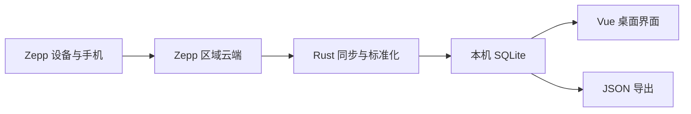

<div align="center">
  
  <h1>ZeppBridge</h1>
  <p><strong>把你的 Zepp 穿戴设备健康数据，同步到你自己的 Windows 电脑。</strong></p>
  <p>Local-first desktop bridge for syncing, exploring, and exporting Zepp wearable health data.</p>

  [](https://github.com/lingcang728/ZeppBridge/actions/workflows/ci.yml)
  [](LICENSE)
  [](https://tauri.app/)
  [](#系统要求)
</div>

> [!IMPORTANT]
> ZeppBridge 是独立的非官方开源项目，与 Zepp Health、Huami、Amazfit 无隶属或背书关系。它只应用于你本人有权访问的账号和数据。

## 为什么做 ZeppBridge

Zepp App 擅长在手机上展示健康数据，但个人很难长期保留、统一查看或交给本地工具进一步分析。ZeppBridge 提供一条透明的本地数据链路：从用户授权的 Zepp 区域服务读取数据，标准化后保存到本机 SQLite，再通过桌面界面和 JSON 导出使用。

- **本地优先**：健康数据库保存在你的电脑，不上传到 ZeppBridge 自建服务器。
- **同步状态可信**：云端拉取时间与健康样本时间分开显示；没有新样本时不会伪装成“数据已更新”。
- **记录可深入**：睡眠和运动均有列表与单条详情，不用停留在不可点击的概览卡片。
- **来源不造假**：保留 `user_fused`、`device`、`unknown` 来源，不擅自合并多设备记录。
- **可导出**：按日期和类型导出结构化 JSON，便于备份或交给你选择的本地 AI 工具。
- **关窗口不停**：关闭主窗口会留在托盘，自动同步继续；托盘菜单可打开、立即同步或退出。

## 当前能力

| 领域 | 已支持 |
| --- | --- |
| 同步 | 日常增量 7 天；历史补拉 1–365 天（默认 30，上限一年）；启动同步；托盘驻留时每 15 分钟检查；可取消 |
| 健康数据 | 心率、静息心率、HRV、睡眠、血氧、压力、步数、运动、训练负荷、VO₂max 等已识别字段 |
| 详情 | 睡眠阶段比例与时长；运动距离、热量、平均/最高心率、训练负荷和 VO₂max |
| 数据管理 | SQLite 去重、来源追踪、用户自选 1–365 天保留（默认 365）、旧数据清理、本地重新解析 |
| 隐私 | Windows Credential Manager 保存 token；前端状态与导出不返回 token；无产品遥测 |
| 外观 | 跟随系统、浅色、深色主题；键盘可操作；760px 起的桌面响应式布局 |

没有真实逐点采样、路线或完整阶段时间轴时，ZeppBridge 不绘制模拟曲线、估算地图或虚构健康值。

## 工作方式



手机代理只用于首次取得你自己的认证信息。认证保存成功后，日常同步由电脑直接访问所配置的 Zepp 区域服务，不需要每次重新验证，也不需要长期保持手机代理。

## 系统要求

- Windows 10 或 Windows 11（x64）
- 一个可正常登录的 Zepp 账号
- 首次连接时，手机与电脑处于同一可信局域网
- 开发构建需要 Node.js 20+、Rust stable 与 WebView2

## 安装

项目目前处于早期公开阶段，安装包尚未签名。为避免让用户习惯性忽略 SmartScreen 警告，正式签名发布前建议从源码构建：

```powershell
git clone git@github.com:lingcang728/ZeppBridge.git
cd ZeppBridge
npm ci
npm run tauri build
```

构建产物目录以 `cargo metadata` 返回的 `target_directory` 为准，随后进入 `release\bundle` 查找 NSIS 或 MSI 安装包。详细环境和门禁见 [开发文档](docs/development/development.md)。

## 第一次连接

1. 启动 ZeppBridge，进入“设置”。
2. 让手机和电脑连接同一个可信 Wi-Fi，点击“开始捕获”。
3. 按页面提示在手机安装临时 CA、设置 Wi-Fi HTTP 代理，然后打开 Zepp 刷新一次数据。
4. 捕获并验证成功后恢复手机为“无代理”，在电脑端停止捕获。
5. 以后直接点击顶栏“立即同步”，不需要重复认证。

Android、厂商 ROM 或 Zepp 的证书固定策略可能拒绝用户 CA；内置捕获不是兼容性保证。请勿通过 root、破解或 patch 绕过系统或应用的安全机制。完整步骤与回退边界见 [连接指南](docs/guides/connection.md)。

## 隐私与安全

- ZeppBridge 不收集产品遥测，也没有自建健康数据云端。
- 同步时仍会连接你授权的 Zepp 区域服务，因此它不是离线应用。
- token 保存在 Windows Credential Manager；`auth.json` 只保存用户 ID、区域主机与更新时间等元数据。
- 健康数据库目前是本机明文 SQLite。共享电脑上请使用独立 Windows 账户，并妥善保护设备。
- 不要把 token、数据库、原始响应、证书私钥或未脱敏日志提交到 issue。

更完整的数据流、证书生命周期与清理范围见 [安全与隐私](docs/reference/security-and-privacy.md)。如发现安全问题，请优先使用 GitHub 的私密漏洞报告，不要公开披露凭据或个人健康数据。

## 开发

```powershell
npm ci
npm run build
npm run tauri dev

cargo fmt --manifest-path src-tauri/Cargo.toml --all -- --check
cargo check --manifest-path src-tauri/Cargo.toml --locked --all-targets
cargo clippy --manifest-path src-tauri/Cargo.toml --locked --all-targets -- -D warnings
cargo test --manifest-path src-tauri/Cargo.toml --locked --jobs 1
```

项目结构：

```text
src/                         Vue 3 页面、路由和同步控制器
src-tauri/src/               Rust 认证、连接器、同步、标准化与存储
src-tauri/icons/             图标母版与平台图标
src-tauri/tauri.conf.json    Tauri 窗口、安全和打包配置
docs/                        使用、架构、安全与开发文档
scripts/windows/             Windows 开发和打包辅助脚本
```

长期维护文档按用途放在 `docs/`：

- [连接指南](docs/guides/connection.md)
- [架构摘要](docs/reference/architecture.md)
- [安全与隐私](docs/reference/security-and-privacy.md)
- [开发与门禁](docs/development/development.md)
- [UI 设计约束](docs/development/ui-guidelines.md)

贡献前请阅读 [CONTRIBUTING.md](CONTRIBUTING.md)。涉及 Zepp 响应的测试数据必须先脱敏并尽量缩减为合成 fixture；不要提交真实 token、用户 ID、设备 ID 或完整健康记录。

## 路线图

- [ ] 更多账号、区域和设备的脱敏兼容性测试
- [ ] 真实 GPS/逐点训练数据的可选详情展示
- [ ] 数据库加密与更完善的本地备份体验
- [ ] 代码签名、SBOM、自动更新与可验证的公开安装包
- [ ] 在稳定的数据契约之上评估本地 REST / MCP 接口

路线图描述方向，不构成完成承诺。当前实现状态以代码、测试和公开 CI 为准。

## 许可证

ZeppBridge 使用 [MIT License](LICENSE)。名称 Zepp、Amazfit 及相关商标属于各自权利人。
